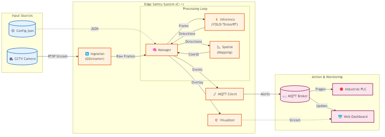
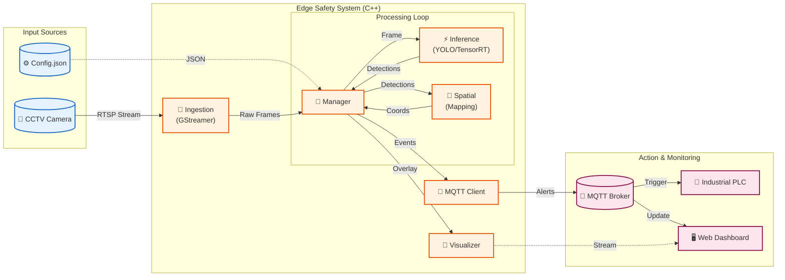

# System Architecture

## End-to-End Architecture Diagram

```mermaid
graph LR
    %% Styles
    classDef input fill:#e3f2fd,stroke:#1565c0,stroke-width:2px;
    classDef core fill:#fff3e0,stroke:#e65100,stroke-width:2px;
    classDef output fill:#fce4ec,stroke:#880e4f,stroke-width:2px;

    %% External Inputs
    subgraph Inputs ["Input Sources"]
        direction TB
        Camera[("🎥 CCTV Camera")]:::input
        Config[("⚙️ Config.json")]:::input
    end

    %% Core System
    subgraph EdgeSystem ["Edge Safety System (C++)"]
        direction LR
        Ingest["🔄 Ingestion<br/>(GStreamer)"]:::core
        
        subgraph Processing ["Processing Loop"]
            direction TB
            Mgr["🧠 Manager"]:::core
            Inf["⚡ Inference<br/>(YOLO/TensorRT)"]:::core
            Spatial["📐 Spatial<br/>(Mapping)"]:::core
        end
        
        MqttC["📡 MQTT Client"]:::core
        Vis["🎨 Visualizer"]:::core
    end

    %% External Outputs
    subgraph Outputs ["Action & Monitoring"]
        direction TB
        Broker[("📨 MQTT Broker")]:::output
        PLC["🛑 Industrial PLC"]:::output
        Dashboard["🖥️ Web Dashboard"]:::output
    end

    %% Connections
    Camera -->|RTSP Stream| Ingest
    Config -.->|JSON| Mgr
    
    Ingest -->|Raw Frames| Mgr
    
    %% Processing Cycle
    Mgr -->|Frame| Inf
    Inf -->|Detections| Mgr
    Mgr -->|Detections| Spatial
    Spatial -->|Coords| Mgr

    %% Outputs
    Mgr -->|Events| MqttC
    Mgr -->|Overlay| Vis
    
    MqttC -->|Alerts| Broker
    Broker -->|Trigger| PLC
    Broker -->|Update| Dashboard

    %% Visualizer output (conceptual)
    Vis -.->|Stream| Dashboard
```
